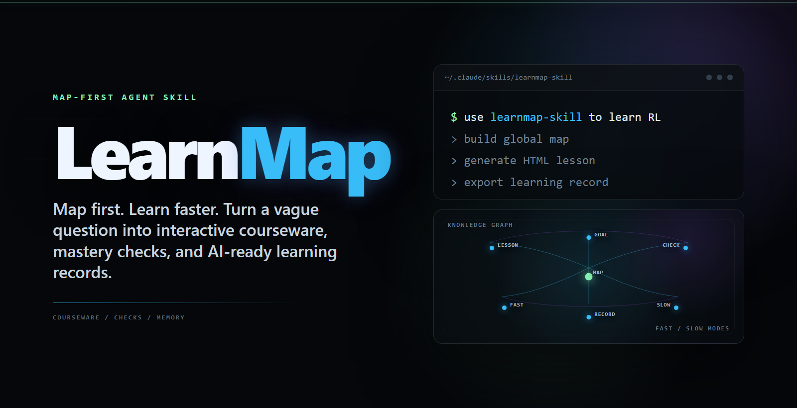
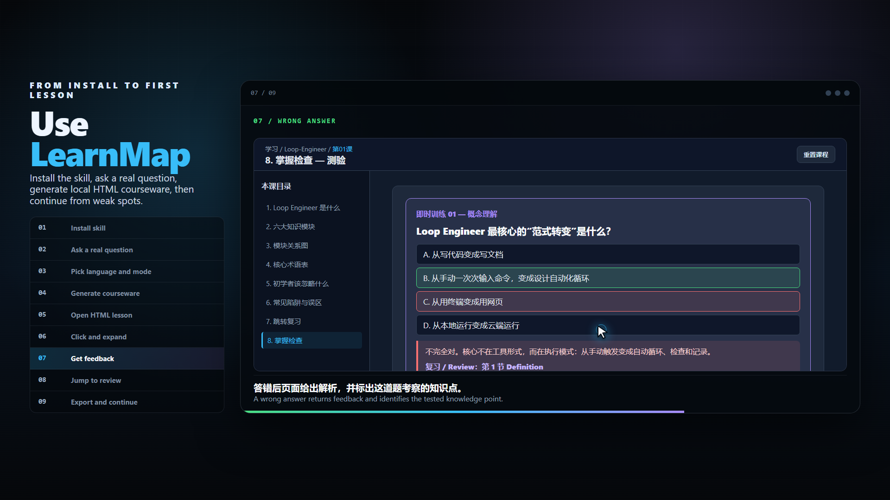

# LearnMap

<p align="center">
  <a href="https://lwbscu.github.io/learnmap/">
    
  </a>
</p>

<p align="center">
  <a href="https://github.com/lwbscu/learnmap"></a>
  <a href="https://lwbscu.github.io/learnmap/promo-video.html"></a>
  <a href="https://lwbscu.github.io/learnmap/"></a>
  <a href="https://mp.weixin.qq.com/s/mO-GAe4arXsKBZTzipwLuA"></a>
  <a href="https://zhuanlan.zhihu.com/p/2050915019571963028"></a>
  <a href="https://juejin.cn/post/7652384976291414054"></a>
</p>

<p align="center">
  <a href="LICENSE"></a>
  <a href="https://skills.sh"></a>
  
  <a href="README.en.md"></a>
  <a href="README.cn.md"></a>
</p>

**Map first. Learn faster.**

LearnMap is an Agent Skill that turns a vague learning request into mapped, interactive HTML courseware. It starts with a knowledge map, then builds lessons with navigation, checks, wrong-answer feedback, review jumps, and exportable learning records for AI follow-up.

<p align="center">
  <a href="https://lwbscu.github.io/learnmap/promo-video.html">
    
  </a>
  <br>
  <a href="https://lwbscu.github.io/learnmap/promo-video.html">Watch the 60-second usage walkthrough</a>
</p>

## What's NEW!

- [2026/07] 🔥 LearnMap adds highlights, multi-style underlines, source-hover notes, portable note packages, and default five-agent generation for higher-quality courseware.
- [2026/06] 🔥 LearnMap adds fast overview mode, slow deep-course mode, and a recorded usage walkthrough.
- [2026/06] 🔥 Optional HTML video explainers and mentor lenses are now opt-in learning paths.
- [2026/05] 🔥 Interactive HTML lessons export learning records for AI follow-up.

## Install

Claude Code user-level install:

```bash
git clone https://github.com/lwbscu/learnmap.git ~/.claude/skills/learnmap-skill
```

Windows PowerShell:

```powershell
New-Item -ItemType Directory -Force "$env:USERPROFILE\.claude\skills" | Out-Null
git clone https://github.com/lwbscu/learnmap.git "$env:USERPROFILE\.claude\skills\learnmap-skill"
```

Codex user-level install:

```powershell
New-Item -ItemType Directory -Force "$env:USERPROFILE\.codex\skills" | Out-Null
git clone https://github.com/lwbscu/learnmap.git "$env:USERPROFILE\.codex\skills\learnmap-skill"
```

## Use

```text
Use learnmap-skill to teach me reinforcement learning. I know Python and want to run a small experiment in one week.
```

```text
使用 learnmap-skill 快速模式教我强化学习。
```

LearnMap asks for language first. If you do not specify a courseware mode, it asks once and defaults to slow mode.

## Courseware Modes

| Mode | Best for | Output |
|---|---|---|
| Fast overview | Quick whole-picture understanding | One condensed interactive HTML page with map, examples, traps, checks, and next steps |
| Slow course | Structured depth | Global map first, then one interactive lesson per chapter |

## What It Produces

| Need | Output |
|---|---|
| Learn a field | Knowledge map, path, chapter lessons |
| Recover from mistakes | Wrong-answer feedback with `Review` jumps back to the source concept |
| Continue later | Markdown or JSON learning records for AI follow-up |
| Explain visually | Optional HTML motion explainer, not generated by default |
| Learn through a lens | Optional mentor-lens brief with examples and boundaries |

## Sources

Learning workflow inspired by [How to Use Claude Code for 10x Learning](https://mp.weixin.qq.com/s/DF2-X_iXMMz6e28v3Da3EQ). The quality gate adapts evaluation ideas from [Darwin Skill](https://github.com/alchaincyf/darwin-skill). The optional mentor-lens workflow adapts cognitive distillation ideas from [Nuwa Skill](https://github.com/alchaincyf/nuwa-skill).

MIT © [lwbscu](https://github.com/lwbscu)
